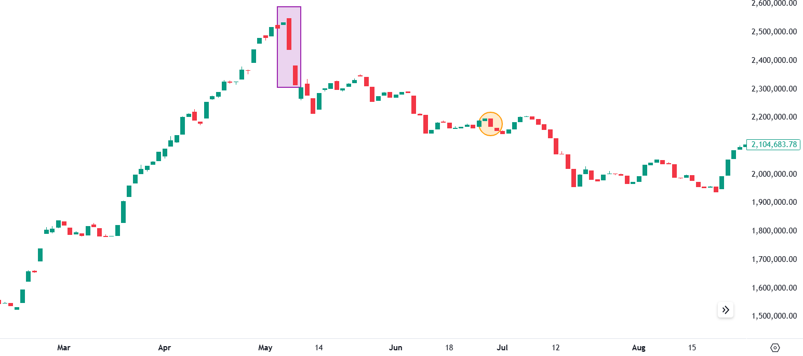
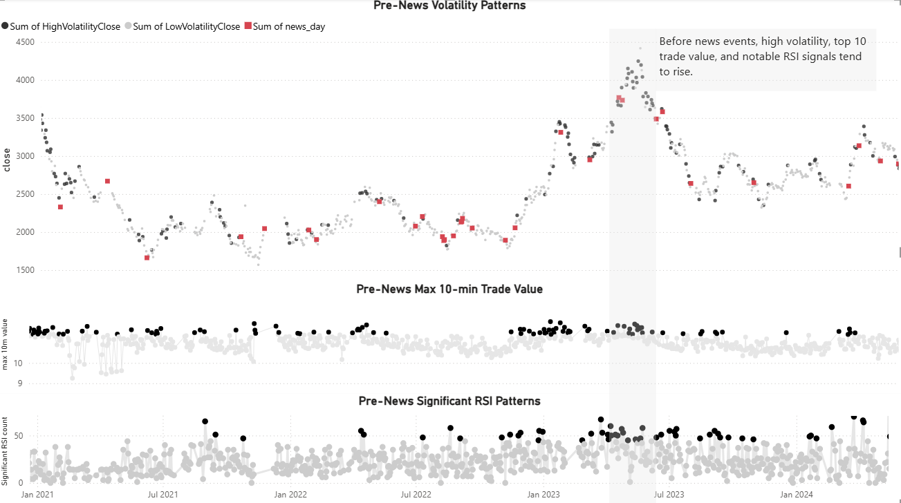
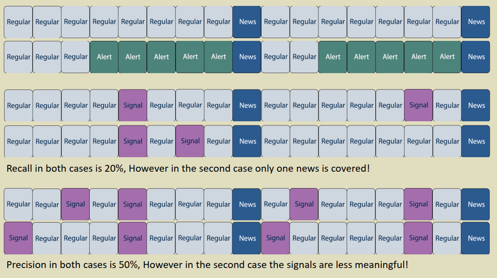
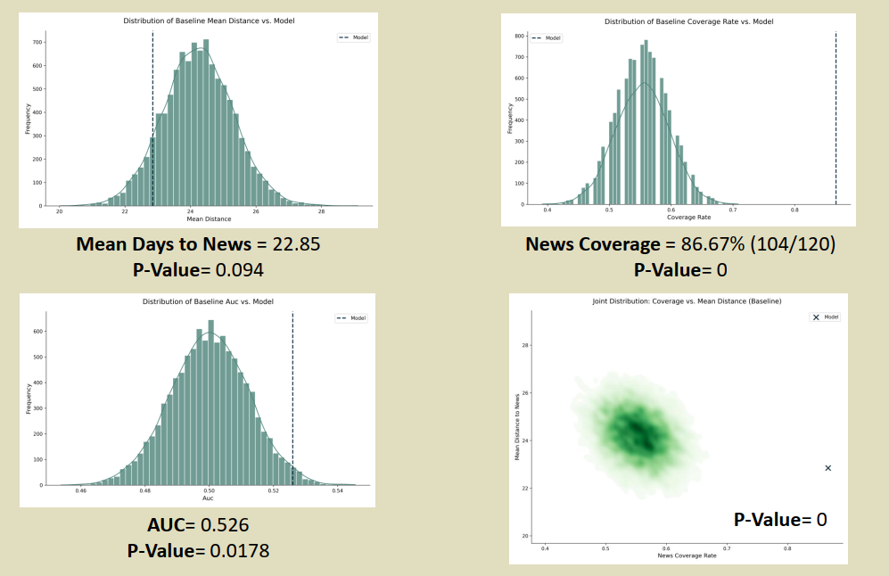
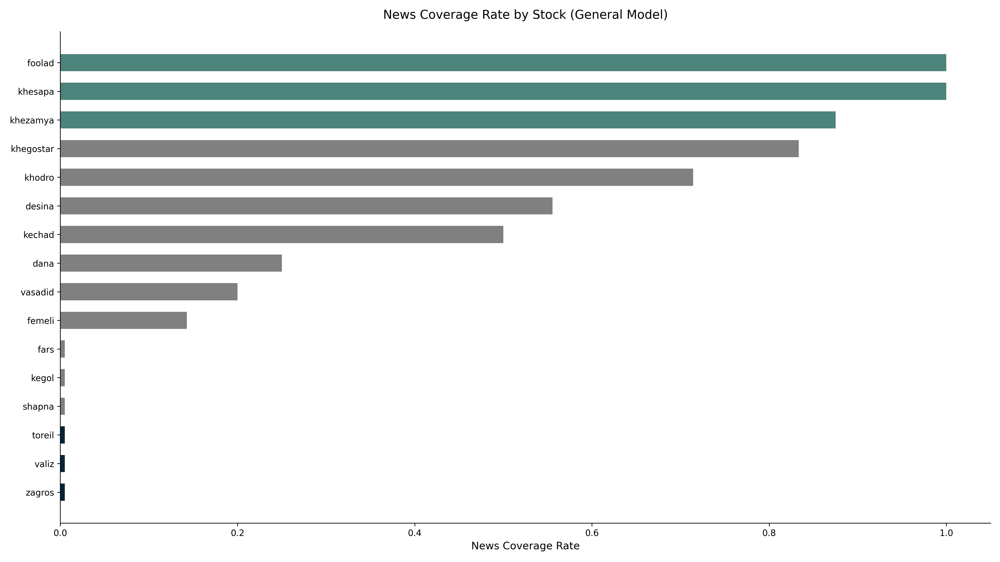
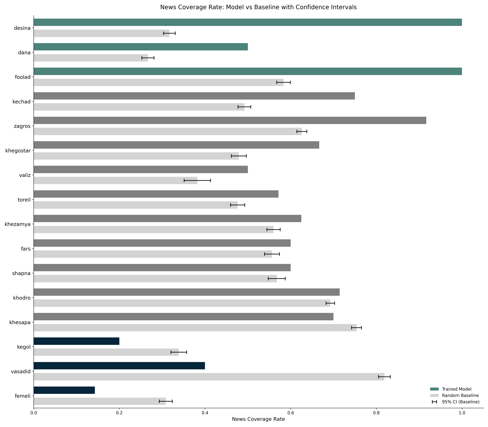
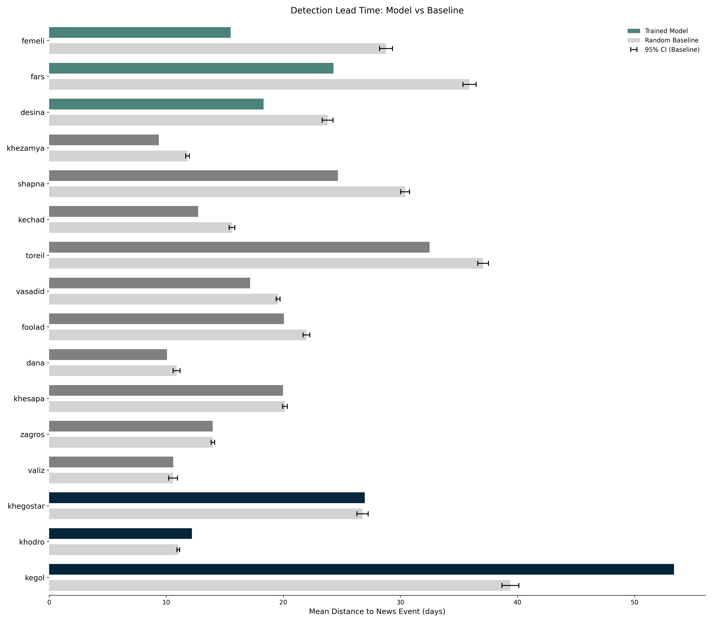
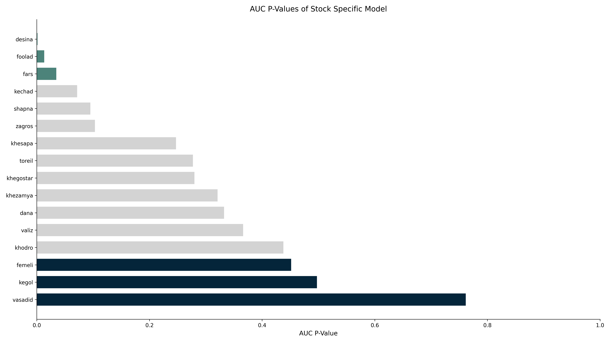

## Project Overview

This project investigates longstanding concerns about insider trading in the Iranian stock market by developing a machine learning framework to identify abnormal trading activity before major corporate announcements. By systematically analyzing high-frequency transaction data, we demonstrated that anomalous price and volume patterns often emerge ahead of significant news, providing regulators with evidence-based tools for surveillance and compliance monitoring.

*Figure 1: The "Black Sunday" index crash in Iran’s stock market, linked to early knowledge of raw material price increases in petrochemical firms. Insiders appeared to act on this information 56 days prior to the official announcement, motivating our investigation into systematic detection methods.*

## Research Motivation

Market speculation has long suggested that some investors trade on privileged information, giving them unfair advantages ahead of news releases. Such suspicions were amplified by episodes like "Black Sunday," when major stock declines occurred weeks before official disclosures. We hypothesized that informed trading would leave measurable signatures in market microstructure data, allowing us to train predictive models that expose patterns of information leakage and highlight gaps in corporate transparency.

## Data Collection and Challenges

Since no public dataset offered the necessary granularity, we built a custom scraping and processing pipeline to collect and align multiple sources:

- Tick-level trades from TSETMC (Iran’s official trading platform)
- Corporate announcements from CODAL (regulatory disclosure system)
- Historical price adjustments accounting for dividends and splits

The project focused on material, non-routine announcements that typically spark volatility (the kinds of events most susceptible to insider exploitation).

## Technical Methodology

### Exploratory Data Analysis

*Figure 2: Trading volatility before announcements. Blue dots = volatility spikes, red dots = news release days. Clustering of blue before red indicates potential information leakage.*

Initial analyses showed distinct spikes in volatility and trading volume preceding announcements. These findings provided statistical support for the hypothesis that certain investors acted on information before it became public.

## Data Pipeline

Our system transformed raw ticks into analyzable features through:

- Minute-level aggregation (OHLC, volume, trade counts)
- Corporate action adjustments for consistent prices
- Feature engineering: over 25 variables, including technical indicators (RSI, Bollinger Bands), volatility metrics, trade imbalance, and microstructure statistics

### Evaluation Framework

*Figure 3: Conventional metrics (precision/recall) fail to capture timeliness of news detection. Identical scores can mask stark differences in practical usefulness.*

To address this, we designed tailored evaluation metrics:

- **News Coverage Percentage**: Proportion of announcements preceded by alerts
- **Median Days to News**: Typical number of days the model anticipates news

### Machine Learning Framework

*Figure 4: Monte Carlo simulations validating model performance beyond random chance. Our ANN model (X marker) shows significantly higher coverage and earlier detection than random baselines.*

We tested multiple architectures, with our ANN model showing significant predictive strength. Statistical validation (10,000 Monte Carlo runs) confirmed the robustness of results, rejecting random coincidence with p-values as low as 0.003.

## Key Findings and Results

### Cross-Company Variation

*Figure 5: Detection strength varies by company, suggesting uneven information control across firms. Notably, the model achieved 0% news coverage for 6 stocks while performing exceptionally well on 3-5 others.*

Not all companies exhibited the same patterns: some showed strong predictive signals, while others appeared nearly opaque. This variation implies differences in corporate governance and information handling.

### Stock-Specific Modeling

*Figure 6: Comparison of stock-specific model performance versus random baselines. The bar plots show news coverage (top) and mean distance to news (bottom) for each stock, with model performance (darker gray) compared against Monte Carlo simulation results (gray). Stocks are sorted by performance difference, with top and bottom performers highlighted.*

Specialized models reinforced these differences. Poor detection on some stocks persisted despite customization, indicating genuine variations in transparency rather than model limitations.

### Regulatory Implications

*Figure 7: Statistical evidence of company-specific detection difficulty, highlighting firms warranting closer scrutiny.*

Our analysis highlights firms with strong evidence of information leakage. These insights could guide regulators in prioritizing investigations and targeting firms with higher risks of insider trading.

## Technical Implementation

### Data Infrastructure

MySQL database managing 300+ MB of historical data, automated quality checks, scalable pipelines

### ML Pipeline

Modular design for experimentation, hyperparameter optimization, custom evaluation metrics, deployment-ready implementation

### Visualization & Reporting

Tableau dashboards for analysis, automated reporting for model results, clear communication of findings through visual storytelling

## My Contributions

As one of three team members, my contributions included:

- Proposing and implementing custom evaluation metrics (Coverage Percentage, Median Days to News)
- Creating interactive dashboards in Tableau for visualization
- Implementing temporal models (RNN/LSTM) for sequence-based detection

## Impact and Applications

Our findings demonstrate how data-driven methods can enhance regulatory oversight and market integrity. Potential beneficiaries include:

- **Regulators*: Detecting and investigating suspicious trading
- **Financial institutions*: Internal surveillance for compliance
- **Academia*: Studying market microstructure and asymmetric information
- **Corporate governance*: Benchmarking transparency practices

## Future Directions

Planned extensions include:

- Natural language analysis of news content
- Expansion to cross-market and international data
- Real-time detection pipelines
- Ensemble methods combining diverse models
- Systematic analysis of cross-market information flows

The complete technical documentation and codebase are available upon request.