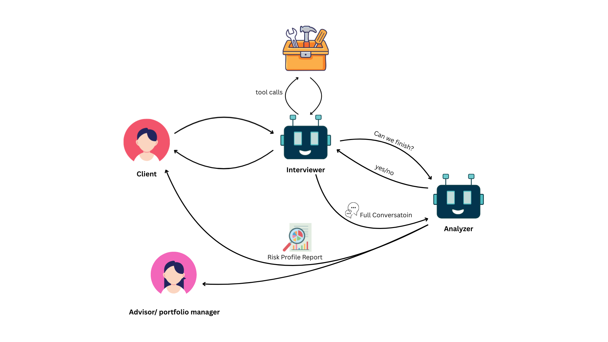
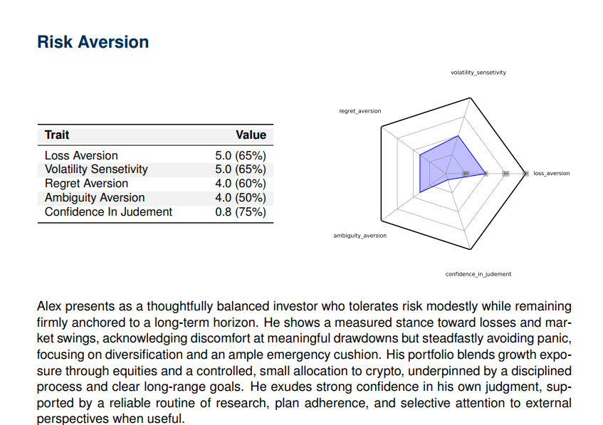

## Abstract

Investor risk profiling is an important part of financial advisory, ensuring that recommendations align with clients’ tolerance and capacity for risk. Traditional methods, however, are limited: questionnaires often feel generic and impersonal, while interviews demand significant time and resources. To address this, we developed an adaptive LLM-driven framework that conducts dynamic, conversational interviews to elicit richer investor insights. The system employs a two-agent architecture—an adaptive interviewer and a risk analyzer—that tailors questions to the user’s expertise, explores risk factors in multiple phases, and produces structured reports containing numerical scores, narrative explanations, and visual outputs. Early testing highlights strong performance in coherence, adaptability, and depth of analysis, suggesting that this approach could meaningfully improve both user engagement and the accuracy of investor profiling.

## Video Demonstration

  <iframe src="https://www.youtube.com/embed/VIDEO_ID_HERE" style="position: absolute; top: 0; left: 0; width: 100%; height: 100%; border: 0;" allowfullscreen title="Adaptive LLM Risk Profiling System Demonstration"></iframe>

*A 3-minute demonstration of the system’s adaptive questioning, conversational flow, and reporting capabilities. [Full video available upon request]*

## Interactive Demo

You can try the adaptive interviewer through our Telegram bot: [@agentic_risk_profiler_bot](https://web.telegram.org/k/#@agentic_risk_profiler_bot), or access the [web interface](http://46.249.101.59:8000/). Both demonstrate the system’s adaptive conversations and phased questioning strategy in real time.

## Research Significance

Reliable risk profiling is vital for regulatory compliance (SEC, ESMA, MiFID II) and for tailoring investment strategies to clients’ financial goals. Yet, the field continues to struggle with a trade-off: questionnaires are scalable but shallow, while human interviews yield deeper understanding at the cost of scalability. This research bridges the gap by using large language models to conduct adaptive, natural interviews that scale like forms but engage like conversations. The framework has the potential to strengthen compliance, improve client trust, and support more personalized portfolio management.

## Methodology

### Modular Agent Architecture

Our design separates interaction from analysis through a two-agent system:

- **Adaptive Interviewer Agent**: Guides the conversation dynamically using:

1. Expertise awareness: adapting phrasing and complexity to user knowledge.
2. Targeted questioning: probing gaps identified in real time.
3. Conversational continuity: maintaining coherence using full dialogue history.

- **Risk Analyzer Agent**: Processes the transcript into structured outputs across multiple dimensions (Risk Aversion, Capacity, Experience, Time Horizon, Volatility Management, Social Influences), each decomposed into fine-grained metrics.

### Interview Flow

The dialogue follows a four-phase structure:

1. **Initial Assessment**: probes general knowledge and baseline attitudes.
2. **Exploration**: covers all risk dimensions systematically.
3. **Deep Dive**: investigates unclear or inconsistent responses using scenarios.
4. **Gap Closure**: Ensures completeness by consulting the analyzer for missing information.

### Technical Implementation

The system is model-agnostic, though current experiments use DeepSeek V3. Tools include:

- A scenario generator for tailoring hypotheticals
- A proficiency estimator for adjusting difficulty
- A termination assistant to detect interview completeness
- Structured reporting via Pydantic to ensure consistent outputs

## Preliminary Results

### Synthetic Evaluation

- Tested on artificial investor personas generated by Grok 4 with predefined risk traits.
- Produced reports that were highly consistent with target profiles.
- Captured nuanced risk behaviors that traditional questionnaires often overlook.

### Pilot Testing

- Trials conducted with the research team and supervising professor.
- Showed natural, adaptive conversation flow with minimal redundancy.
- Feedback emphasized stronger coherence and personalization compared to industry-standard tools.

## Future Research Directions

Planned extensions include:

- **Controlled Human Studies**: comparing system outputs against traditional questionnaires in a 20-participant within-subjects design.
- **Integration with Trading Data**: incorporating historical behavior to enrich profiling.
- **Framework Expansion – adapting**: for traders’ self-assessment and portfolio manager evaluations.
- **Advanced Scenario Simulation**: using Monte Carlo–style stress tests for quantitative skill evaluation.

## Contributions

This collaborative research project represents joint work with Farjad Fallah under the supervision of [Dr. Barak](https://scholar.google.com/citations?user=C53gU8gAAAAJ&hl=en) at the University of Southampton.

**Farnoush Fallah** designed and implemented the analyzer agent, conducted literature review on risk profiling methodologies, and created the report generation framework.

**Farjad Fallah** designed and implemented the interviewer agent, developed the Telegram bot interface, handled system integration, and conducted synthetic testing.

## Publication Status

The project originated as a final assignment for an advanced LLM course and is now being extended into a research paper under Dr. Barak’s supervision at the University of Southampton. A full technical report is available upon request.
