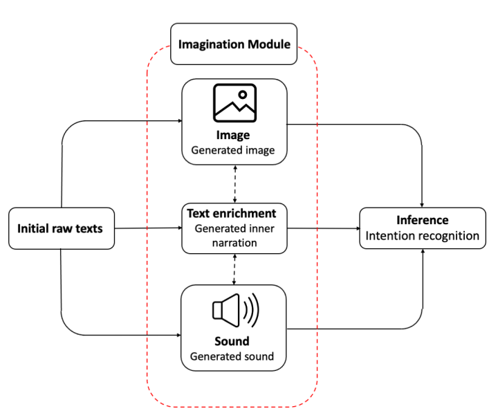

## Overview

MIIRA is a new framework that equips AI systems with an imagination module to better handle ambiguity in human-robot interaction. Drawing inspiration from human cognition, MIIRA produces internal multimodal simulations—narrative, visual, and auditory—based on minimal textual instructions. By expanding sparse commands into richer context, MIIRA improves the system’s ability to understand intent in complex domestic scenarios. The framework demonstrates state-of-the-art performance on the HandMeThat-v2 benchmark.

**Keywords:** Intent Recognition, Human-Robot Interaction, Multimodal Reasoning, Imagination-Augmented AI, Ambiguity Resolution

*A short 3-minute video presentation of this project. (Placeholder - replace VIDEO_ID)*

## Motivation

Natural language commands in human-robot interaction often leave out critical details. For example, “hand me that from the sofa” requires grounding to identify what “that” refers to. Text-only AI models often misinterpret such instructions. Humans overcome this by mentally simulating the situation, imagining scenes, sounds, and narratives. At the Speech and Language Processing Lab (SLPL), Sharif University, this project explored whether AI could adopt a similar strategy, using imagination to bridge the gap between abstract language and concrete interpretation.

## Methodology: An Imagination-Augmented Pipeline

MIIRA extends multimodal language models with a three-stage process:

1. Text Enrichment: A lightweight LLM (Qwen-3B) expands short labels into rich, modality-specific descriptions: one visual (covering spatial layout, objects, and appearance) and one auditory (covering sounds and ambient cues).

2. Multimodal Generation: These descriptions are converted into percepts: Flux generates images from visual narratives, and Stable Audio produces short sound clips from auditory narratives.

3. Fusion & Recognition: The original instruction, enriched text, and generated percepts are combined. A multimodal LLM (Qwen2.5-Omni 3B) integrates these inputs to resolve ambiguity and infer user intent.

*The end-to-end MIIRA pipeline. Sparse text input is enriched through an internal imagination module that generates narrative, visual, and auditory context. These multimodal cues are fused to resolve referential ambiguity and accurately predict user intent.*

## Experimental Setup

The framework was tested on HandMeThat-v2, a benchmark of 116,146 episodes for evaluating ambiguous instructions in grounded contexts. To keep experiments efficient, a 400-episode subset was sampled evenly across difficulty levels and goal templates. Performance was measured using Full Accuracy, requiring correct identification of both the object category and its instance. An ablation study compared text, enriched text, image, and audio modalities in isolation and combination.

## Key Findings

Our experiments revealed a consistent pattern in how different modalities contribute to resolving ambiguity in human-robot interaction:

The inclusion of generated images produced the largest single improvement in accuracy, particularly at intermediate difficulty levels (Levels 2–3). These visual cues helped the model reliably identify both the category and approximate location of the target object, providing the kind of grounding that purely textual models often lack. In many cases, the addition of an image reduced error rates by a significant margin compared to text-only baselines.

At the highest ambiguity level (Level 4), enriched textual narratives were critical. Unlike raw instructions, the enriched descriptions explicitly stated relational constraints (e.g., *“the red mug inside the top drawer of the blue cabinet”*), enabling the model to distinguish between multiple similar candidates. This modality proved essential for precise instance-level reasoning where visual cues alone were insufficient.

The combination of text and image consistently outperformed any single modality, showing that the two provide complementary strengths. Images captured appearance and spatial layout (*what* and *where*), while enriched text added logical and relational clarity (*which one*). Together, they offered a more holistic understanding, producing robust performance across all difficulty levels.

While the audio modality contributed smaller gains overall, it was not negligible. In scenarios involving action-related cues (e.g., differentiating *pouring water* from *placing a cup*), generated sound provided useful context. The limited improvement is attributed more to current limitations in text-to-audio generation quality than to the irrelevance of auditory grounding, suggesting future potential as generative audio models mature.

Overall, the results demonstrate that imagination-augmented reasoning is both effective and interpretable. By showing a clear division of labor between modalities, our findings support the idea that multimodal imagination can serve as a powerful bridge between abstract commands and grounded intent understanding.

The table below presents a summary of performance across various modality combinations and levels of task difficulty, highlighting these results.


*Performance comparison of various modality combinations on the HandMeThat-v2 dataset. Text + Image performs best at intermediate levels, while Text + Enriched Text excels under high ambiguity (Level 4).*

## My Contributions

I co-led this research project and played a central role in both the design and implementation of the MIIRA framework. My contributions spanned the entire lifecycle of the work, from conceptual design to technical execution and analysis:

I was primarily responsible for conceiving and building the imagination component at the heart of MIIRA. This included designing the text enrichment pipeline, where I experimented with different prompting strategies (“reasoning” vs. “no-reasoning”) to generate high-quality, modality-specific narratives that could later be transformed into perceptual simulations.

I developed the simulation pipelines from the ground up, integrating Flux for image generation and Stable Audio for sound generation. This required addressing non-trivial challenges such as ensuring semantic alignment between generated percepts and the dataset episodes, and synchronizing the temporal aspects of audio with the underlying task context.

I designed and carried out the complete ablation study, systematically isolating the contribution of each modality and testing all combinations across difficulty levels. This work involved developing a rigorous evaluation protocol and running large-scale experiments to uncover the complementary strengths of enriched text, images, and audio.

Beyond implementation, I took responsibility for interpreting experimental outcomes. I identified the modality-specific “division of labor” that became the central insight of this project: images provide strong grounding for *what* and *where*, while enriched text is key to resolving *which one* under high ambiguity.

Currently, I am extending this work by incorporating larger foundation models into the pipeline to test scalability and improve overall accuracy. I am also refining the multimodal alignment process to enhance robustness and prepare the system for submission-ready results.

Through these contributions, I helped shape MIIRA not just as a technical system, but as a research framework that demonstrates the promise of imagination-augmented reasoning for multimodal AI and human-robot interaction.

## Publication

This work is being prepared for submission to a leading AI/NLP conference (ACL, EMNLP, NeurIPS). A draft can be shared upon request. For details or collaboration, please contact me at [farnoushfallah05@gmail.com](mailto:farnoushfallah05@gmail.com).